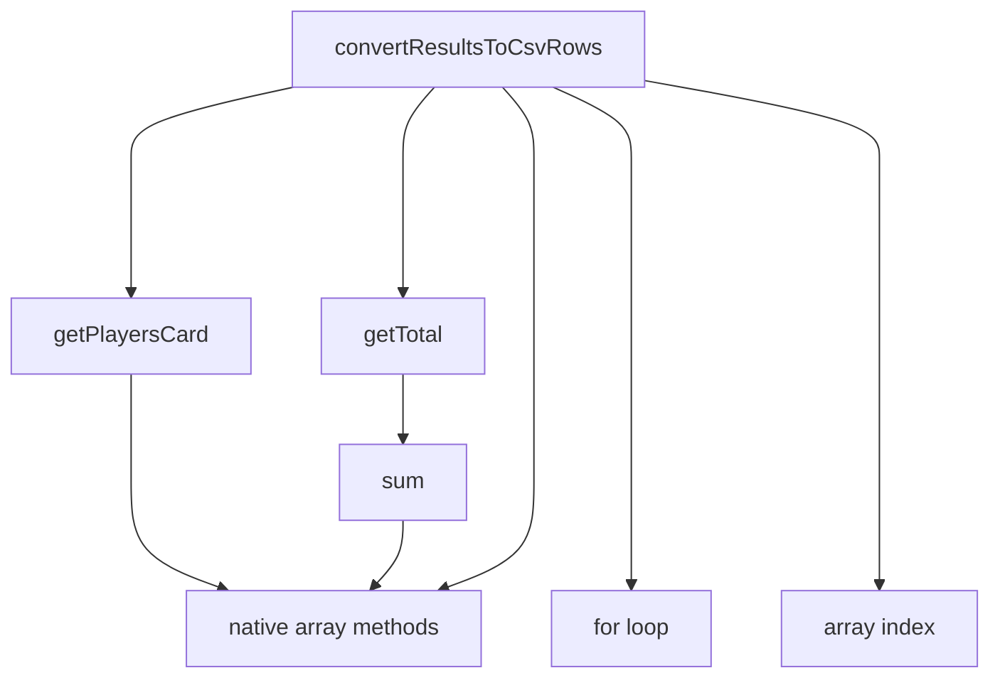
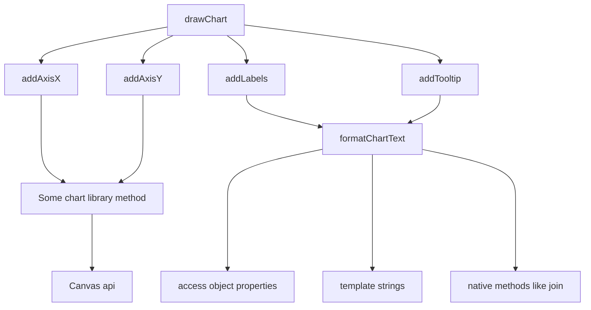

# Refactoring with stratified design

---

---
layout: intro
other: none
---

# Outline

<v-clicks>

- Some background
- Startified design as a concept
- Coding
- Recap

</v-clicks>

---

# What's the point?

<v-clicks>

- Readability, maintainability, testability etc
- Power of conceptualization
- Fun?

</v-clicks>

---
layout: image-right
image: https://images.manning.com/360/480/resize/book/1/95bb6e9-2f59-4e68-b339-933d823d5006/Grokking_Simplicity_hires.png
---

- Normand, Eric 2021: Grokking simplicity. Manning.

<v-clicks>

- _Stratified design_
- Some basic refactoring patterns

</v-clicks>

---

# A totally contrived example

```typescript{0|1-4|5-9|10-13}
const users: Player = [
  { name: "Paul", id: 1, strokes: undefined, rank: undefined },
  { name: "Ricky", id: 2, strokes: undefined, rank: undefined },
];
const holes: Hole = [
  { no: 1, par: 3 },
  { no: 2, par: 3 },
  { no: 3, par: 4 },
];
const scoreCards: ScoreCard = [
  { userId: 1, strokes: [2, 2, 4] },
  { userId: 2, strokes: [2, 2, 3] },
];
```

---
layout: two-cols
other: none
clicks: 14
---

```typescript{11-27|0|14|23|13,17|18,19,20|21|all|13,17,18,19,20,24|3-5|7-8|0|all}
import sum from "mathlib";

const getTotal = (results: number[]) => {
  return sum(results);
};

const getPlayersCard = (player: Player, scoreCards: ScoreCard[]) => {
  return scoreCards.find((scoreCard) => scoreCard.playerId === player.id);
};

const convertResultsToCsvRows = (players: Player[]): string[] => {
  const rows: string[] = [];
  for (let player of players) {
    const card = getPlayersCard(player, scoreCards);
    let row: ScoreRow[] = [];
    const results: number[] = [];
    for (let i = 0; i < holes.length; i++) {
      const hole = holes[i];
      const strokes = card.strokes[i];
      const par = holes[i].par;
      results.push(strokes - par);
    }
    const total = getTotal(results);
    rows.push([...results, total].join(","));
  }
  return rows;
};
```

::right::

<ul>
<li v-click="8">native language features</li>
<li v-click="9">generic function</li>
<li v-click="10">specific functions of domain X  </li>
<li v-click="11">specific functions of domain Y  </li>

</ul>

<v-click at="13">



</v-click>

---
layout: two-cols
other: none
---

# Some principles

<v-clicks>

- "Arrow length": reaching out to features on a different layer
- Level of details vs. current level of thinking
- Abstraction barriers: set of functions forming a line not to be crossed

</v-clicks>

<v-clicks at="5">

- Maintainability, testability, reusability
- Cf. traditional concept of domains

</v-clicks>

::right::

<v-click at="4">



</v-click>

---
clicks: 13
---

# Conceptualizing a familiar process

- How to make a language feature first-class?

<div class="flex">

<div v-click="2">

```typescript{all|all|all|all|all|all|all|1|3-5|2}
try {
  doSomething();
} catch {
  logErrors();
}
```

</div>

<div class="ml-4" v-click="2">

```typescript
try {
  doSomethingElse();
} catch {
  logErrors();
}
```

</div>

<div class="ml-4" v-click="10">

```typescript
function doSomethingAndLogErrors() {
  try {
    doSomething();
  } catch {
    logErrors();
  }
}
```

</div>

<div class="ml-4" v-click="11">

```typescript
function doAndLogErrors(f) {
  try {
    f();
  } catch {
    logErrors();
  }
}
```

</div>


</div>

<v-click at="6">

- As a pattern: replace body with callback

</v-click>

<ol>
<li v-click="7">identify <em>before</em></li>
<li v-click="8">identify <em>after</em></li>
<li v-click="9">identify <em>body</em></li>
<li v-click="10">Extract the whole thing as a function</li>
<li v-click="11">Extract the body of the function as a callback passed as an argument</li>
</ol>

---

# Workshop

<v-clicks>

- a) Take a look at files at `./examples/`
  - look at the code and try to figure out a logical structure
  - stratify the code into logical layers 
  - should work well as a pair-programming excercise
- b) Think about a piece of code you wrote today / this week
  - Think about the strata in that code
  - sketch out a call graph with arrows of different length
  - would it make sense to move something around?
  - would that bring any benefits in terms of maintainability / readability / testability?

</v-clicks>


