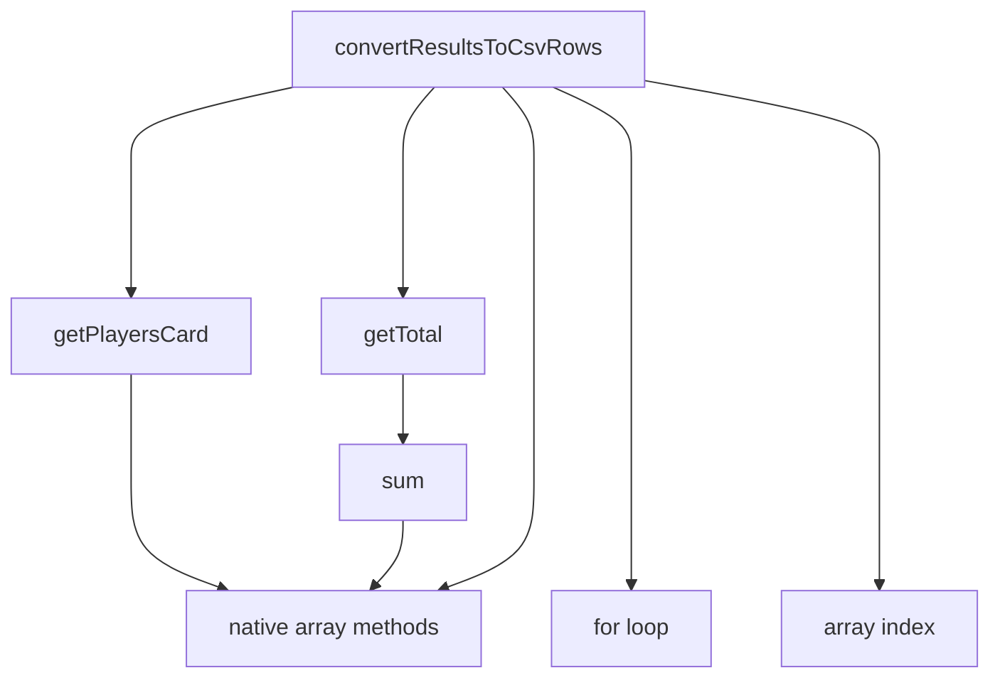
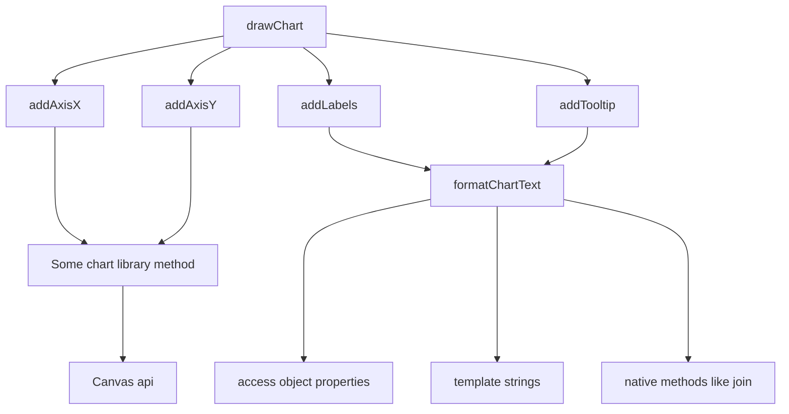

# Refactoring with stratified design

<!-- 

Hi there, so, my talk is not about the cool new frameworks out there, but about 
something mysterious called Stratifies design.

And there's another word - refactoring.... Ideally, you would want to talk about designing and
how you start a new project with a perfect design, a perfectly clear way to think
about code and structure, but we all know how it is in the real world: 
rather than writing new code on a clean sheet we end up reading old code.

And old code tends to be messy. And tedious to understand. And you are trying
to just fix this small bug in the way the user sees the train ticket prices 
rendered on the screen...

Stratified design is a tool that could possibly help with this tedious everyday task.

-->

---

---
layout: intro
other: none
---

# Outline

<v-clicks>

- Some background
- Stratified design as a concept
- A somewhat modified example from a real-world API 

</v-clicks>

<!--

So, just to quickly sum up the journey I'm trying to take you guys onto:

- First, a bit of background: why is this a thing
- Then let's define the terms and de-mystify the word stratified
- And after that's out of the way let's look at an example


-->

<v-click>


</v-click>

<!-- 

Stratified is a past participle form of an English verb which comes from ... surprise, surprise..
a Latin noun, stratum,  meaning.. well, basically, something layered, in today's speech. You would, of course,
recognize other derivatives such as stratosphere etc.

So we are going to talk about layers and look at code the same way ew can look that rock there
showing different layers of chalk. Which is probably a good comparison to a lot of my own code, at least. chalk.

-->

---

# What's the point?

<v-clicks>

- Readability, maintainability, testability etc
- Ability to work on the correct level of detail
- Power of conceptualization

</v-clicks>

<!-- 

Why would we want to follow a pattern, something like stratified design when writing our code?

Well, of course, there are these three fellows: readability, maintainability, testability. There 
is a big difference in all those if we compare a code base designed according to something
and code that is just... well, written, to solve a particular problem at a particlar time.

And if we look at stratified design in particular, a special gain, something we hope to get with 
this is the ability to focus on the right stuff, not to worry about details belonging to another 
layer when you're working on another.

One thing I do want to emphasize here is the fact that this is probably nothing  new to any of you.
This is probably something you all do, at least to some extent, intuitively and naturally in your 
everyday work when reading your co-workers' pull requests and making comments like
'this would be more readable if you would extract thing here' ... or  just having
a feeling that some piece of code could be structured differently without 
being quite able to describe the problem in words. Tools like stratified design 
are there to help us conceptualize these kind of feelings: they are a tool for us to communicate
and that's what is imprtant. You can probably make the same kinds of conceptualizations
with other tools, but this is one I have personally found useful.


-->

---


<v-clicks>

```typescript{0|1-4|5-9|10-13}
const users: Player = [
  { name: "Paul", id: 1, strokes: undefined, rank: undefined },
  { name: "Ricky", id: 2, strokes: undefined, rank: undefined },
];
const holes: Hole = [
  { no: 1, par: 3 },
  { no: 2, par: 3 },
  { no: 3, par: 4 },
];
const scoreCards: ScoreCard = [
  { userId: 1, strokes: [2, 2, 4] },
  { userId: 2, strokes: [2, 2, 3] },
];
```

</v-clicks>

<!-- 

Now before diving into the real world example I promised to show you, let's look
at something totally contrived.   Here's some data in the form of typescript objects

This piece of data has players.. Competing in the sport of disc golf... Which is done by 
playing holes, which would ideally be completed within three or four strokes.

So when our player play through the holes they fill in a score card representing how well they
have performed on the course.

-->

---
layout: two-cols
other: none
clicks: 14
---

```typescript{11-27|0|14|23|13,17|18,19,20|21|all|13,17,18,19,20,24|3-5|7-8|0|all}
import sum from "mathlib";

const getTotal = (results: number[]) => {
  return sum(results);
};

const getPlayersCard = (player: Player, scoreCards: ScoreCard[]) => {
  return scoreCards.find((scoreCard) => scoreCard.playerId === player.id);
};

const convertResultsToCsvRows = (players: Player[]): string[] => {
  let rows: string[] = [];
  for (let player of players) {
    const card = getPlayersCard(player, scoreCards);
    let row: ScoreRow[] = [];
    let results: number[] = [];
    for (let i = 0; i < holes.length; i++) {
      const hole = holes[i];
      const strokes = card.strokes[i];
      const par = holes[i].par;
      results.push(strokes - par);
    }
    const total = getTotal(results);
    rows.push([...results, total].join(","));
  }
  return rows;
};
```

::right::

<ul>
<li v-click="8">native language features</li>
<li v-click="9">generic function</li>
<li v-click="10">specific functions of domain X  </li>
<li v-click="11">specific functions of domain Y  </li>

</ul>

<v-click at="13">



</v-click>

<!--

Now, let's imagine we want to calculate each player's results and turn them into 
a csv file. This made-up code right here might be one way to do it.

We have a function called convertResultsToCsvRows which is basically going through 
each player, finding their scorecards...

Calculating the total strokes for each player...

by looping through each hole they played...

and looking at how many strokes they have in their scorecard

and getting their result by subtracting the par of the hole


But you definitely don't get a particular sense of design by looking at this code.
It's not straightforward to know what are the right details I should be worried aout at 
each stage of the code and if I were to have to add some new functionality to this code
or perhaps fix a bug, I would have to spend a good amount of time scanning through each line
and thinking about what it should be doing.

So we get the sense that this code could use some refactoring, but the problem is: how to 
communicate that? Let's see, how stratified design could be used as a tool to conceptualize this.

If you recall from the beginning, stratified basically means layered, so we're looking for layers
in the code. The basic idea is that a well designed code would work on a reasonable number of 
layers so that each layer contains elements that belong to the same domain or deal with the same 
level of detail. With such a layered design, it should be easy for us to quickly find the place
dealing with the functionality we are interested in at the moment.

Now stratified design is essentially a concept associated with functional programming. This means 
that a typical way to arrange the code into layers is to work with multiple different functions
each consisting of logic belonging to a similar kind of layer. If a function deals with multiple different
kinds of layers at the same time, that is usually a sign that the reader of the function is probably 
going to have to use a lot of mental capacity to navigate through it. A function working mainly
on a single related layer could be called straightforward and is generally something you would want to achieve

So, looking at this convertResultsToCsvRows function here you could identify,
for instance, these kinds of layers:

- we have native language features such as for loops, accessing an array by
  index and using array methods such as pushing, joining....
- We also call another function of a rather generic nature called getTotal
  which sums up an array using anoter, more generic function
- And call another function, but this time it's not a generic one outputting a
  result of a mathematical operation but rather a lot more specific one,
  dealing with players and their scorecards

So we could say that the convertResultsToCsvRows function is basically working
on three or four different layers.  This could be represented with a call graph,
where we try to represent the relationship of each of these layers by drawing a
line from our current function to the the features and functions it uses.
Like this:

So the idea here is that at the very bottom we have the low-level stuff, the
language features like for loops and accessing an array by index. 

Then the more generic function calls are closer to these and the more
domain-specific ones closer to the top. So if we were to refactor this, we 
could use this as a starting point and think about how we could have the
functions yield a different kind of graphs, ideally one where all the arrows 
would be of roughly the same length and point to same kinds of constructs. That
would be the first step of converting the function to a straightforward
implementation.
 

-->


---
layout: two-cols
other: none
---

# Some principles

<v-clicks>

- "Arrow length": reaching out to features on a different layer
- Level of details vs. current level of thinking
- Abstraction barriers: set of functions forming a line not to be crossed

</v-clicks>

<v-clicks at="5">

- Maintainability, testability, reusability
- Cf. traditional concept of domains

</v-clicks>


::right::

<v-click at="4">



</v-click>


---
clicks: 13
---


# KOA api as an example


<v-clicks>

- Task: create an alarm

</v-clicks>


