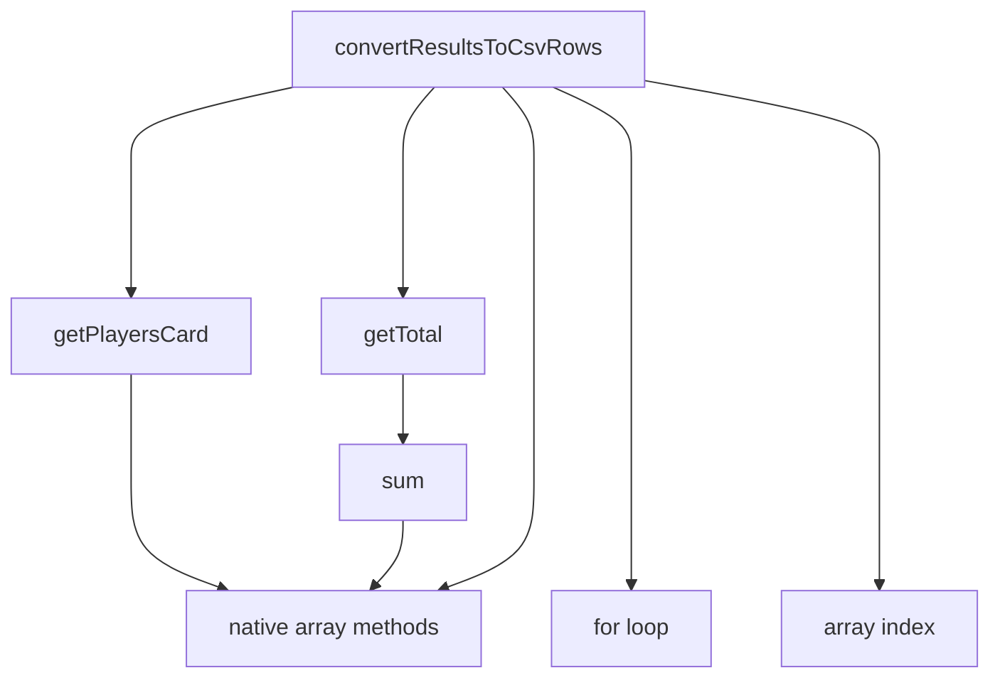

# Refactoring with stratified design

---

---

layout: intro
other: none

---

# Outline

<v-clicks>

- Some background
- Startified design as a concept
- Coding
- Recap

</v-clicks>

---

# What's the point?

<v-clicks>

- Readability, maintainability, testability etc
- Power of conceptualization
- Fun?

</v-clicks>

---

# A totally contrived example

```typescript{0|1-4|5-9|10-13}
const users: Player = [
  { name: "Paul", id: 1, strokes: undefined, rank: undefined },
  { name: "Ricky", id: 2, strokes: undefined, rank: undefined },
];
const holes: Hole = [
  { no: 1, par: 3 },
  { no: 2, par: 3 },
  { no: 3, par: 4 },
];
const scoreCards: ScoreCard = [
  { userId: 1, strokes: [2, 2, 4] },
  { userId: 2, strokes: [2, 2, 3] },
];
```

---
layout: two-cols
other: none
---

```typescript{11-27|0|14|23|13,17|18,19,20|21|all}
import sum from "mathlib";

const getTotal = (results: number[]) => {
  return sum(results);
};

const getPlayersCard = (player: Player, scoreCards: ScoreCard[]) => {
  return scoreCards.find((scoreCard) => scoreCard.playerId === player.id);
};

const convertResultsToCsvRows = (players: Player[]): string[] => {
  const rows: string[] = [];
  for (let player of players) {
    const card = getPlayersCard(player, scoreCards);
    let row: ScoreRow[] = [];
    const results: number[] = [];
    for (let i = 0; i < holes.length; i++) {
      const hole = holes[i];
      const strokes = card.strokes[i];
      const par = holes[i].par;
      results.push(strokes - par);
    }
    const total = getTotal(results);
    rows.push([...results, total].join(","));
  }
  return rows;
};
```

::right::

<v-click>

- native language features
- generic functions
- specific functions of domain X
- specific functions of domain Y

</v-click>

<v-click>

</v-click>

<!--

- when to think about perf?
- "too many functions!!"
- asldkjasd

- basic principles: actions, calculations data

  - actions inevitable

- books:

  - grokking
  - 5 lines of code + fowlerian stuff
  - TDD in django book (attitude)

- tools:
  - slidev
-->
